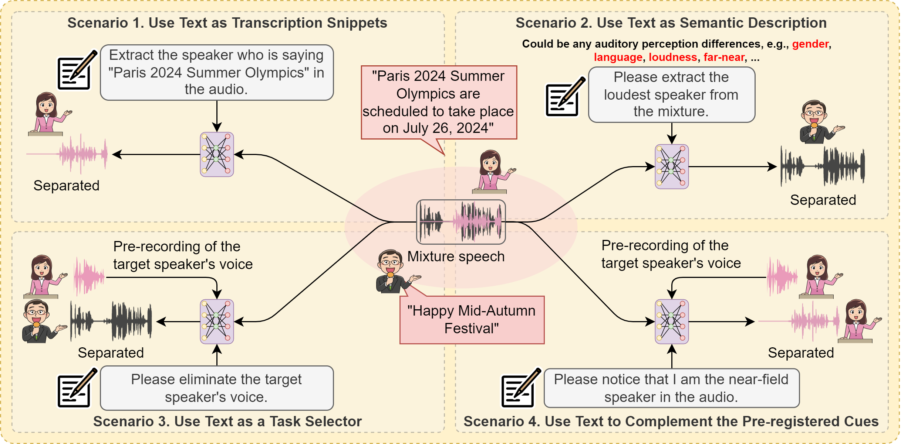
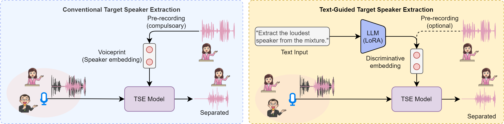

# Typing to Listen at the Cocktail Party: Text-Guided Target Speaker Extraction (LLM-TSE)

      

## Abstract

Humans possess an extraordinary ability to selectively focus on the sound source of interest amidst complex acoustic environments, commonly referred to as cocktail party scenarios. In an attempt to replicate this remarkable auditory attention capability in machines, target speaker extraction (TSE) models have been developed. However, the effectiveness of these models is hindered in real-world scenarios due to the potential variation or even absence of pre-registered cues. To address this limitation, this study investigates the integration of natural language to enhance the flexibility and controllability of existing TSE models. Specifically, we leverage a large language model (LLM) to extract useful semantic cues from the user's typed text input, which can complement the pre-registered cues or work independently to control the TSE process. Our experimental results demonstrate competitive performance when only text-based cues are presented, and a new state-of-the-art is set when combined with pre-registered acoustic cues. To the best of our knowledge, this is the first work that has successfully incorporated text-based cues to guide target speaker extraction, which can be a cornerstone for cocktail party problem research.

      
    (Comparison between the conventional TSE system and our proposed Text-Guided TSE system. The conventional systems rely on the pre-registered voiceprint of the target speaker as an extraction cue, while our system offers the flexibility to incorporate text-based cues to facilitate the target speaker extraction.)

## Dataset

We will release the LLM-TSE dataset soon.

## Models

We will release pre-trained models soon.